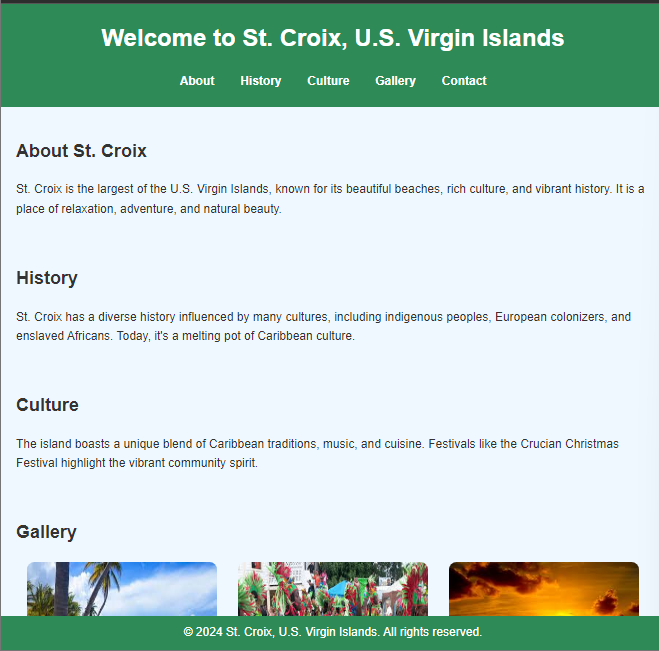

# St. Croix - Hometown Homepage

This project is a simple homepage for St. Croix, U.S. Virgin Islands. It provides information about the island's culture, history, and beautiful scenery. The page is created using HTML and CSS, following the structure and styles learned from the Scrimba Learn HTML and CSS course.

## Live Demo

[Click here to view the live demo](https://scrimba-horatio-hometown-site.netlify.app/)

## Screenshot

## Features

- **Responsive Design:** The page is designed to be mobile-friendly and adapts to different screen sizes.
- **Navigation:** Includes a navigation menu for easy access to different sections such as About, History, Culture, Gallery, and Contact.
- **Gallery:** Showcases images of St. Croix's scenic beauty.
- **Contact Form:** A simple form to allow visitors to get in touch.

## Project Structure

- `index.html`: The main HTML file that contains the structure of the webpage.
- `styles.css`: The CSS file used for styling the webpage.

## How to Use

1. Clone or download the repository.
2. Open the `index.html` file in your web browser to view the homepage.

## Sections

- **About:** General information about St. Croix, U.S. Virgin Islands.
- **History:** A brief history of the island and its cultural influences.
- **Culture:** A description of the unique culture of St. Croix, including local traditions and festivals.
- **Gallery:** A photo gallery showcasing the island’s beauty.
- **Contact:** A form for visitors to reach out for more information.

## Future Improvements

- Add more interactive elements such as animations or hover effects.
- Integrate JavaScript for form validation and additional interactivity.
- Add more photos to the gallery and include a photo carousel.

## Contributing

Feel free to submit pull requests to improve the design or functionality of this project.

## License

This project is open-source and available under the MIT License.
